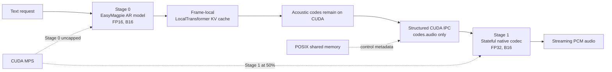

# EasyMagpie native vLLM-Omni optimization

## Session summary and engineering presentation

**Date:** 2026-07-28
**Target hardware:** NVIDIA RTX A4500
**Runtime:** vLLM / vLLM-Omni 0.24
**Workload:** EasyMagpie streaming TTS, 16 requests at concurrency 16
**Primary objective:** maximize RTFX while preserving output integrity and
stable real-time playback

---

## Executive summary

This session optimized a two-stage native vLLM-Omni EasyMagpie pipeline running
on one GPU:

1. Stage 0 autoregressively generates acoustic codes.
2. Stage 1 runs the stateful native FP32 audio codec.
3. Audio codes cross the process boundary through a custom same-GPU CUDA IPC
   path.

The work produced two useful operating points:

| Operating point | Mean RTFX | Median RTFX | Req/s | TTFA | ITL | Underruns |
| --- | ---: | ---: | ---: | ---: | ---: | ---: |
| Maximum throughput | **44.98x** | **45.80x** | **7.19** | **182.9 ms** | **116.4 ms** | Startup-only |
| Active zero-underrun profile | **43.42x** | **43.69x** | **6.93** | **209.6 ms** | **120.7 ms** | **0 / 1,130** |

In the controlled MoE A/B, the maximum-throughput profile was:

- **17.9% faster in mean RTFX**
- **18.3% faster in request throughput**
- lower in both TTFA and ITL

than the shared-stream/default-tile comparison profile.

The active profile exchanges approximately 3.9% RTFX and 27.8 ms TTFA for
zero measured underruns. All 80 requests succeeded.

Output integrity was checked with 10 unique WAVs:

- **5.26% WER**
- **1.74% CER**
- 6/10 exact after Whisper normalization
- **2.79% WER / 0.40% CER** after excluding two short proper-name prompts that
  Whisper rendered phonetically

---

## Optimized architecture



The final deployment remains fully native:

- no TensorRT codec plan;
- no Triton codec server;
- no replacement of the vLLM stateful codec;
- Stage 0 and Stage 1 remain independent vLLM processes on one GPU.

---

## Performance progression

The following table combines several experiment series. It shows engineering
progress, but only rows explicitly marked as controlled A/B should be treated
as strict like-for-like comparisons.

| Milestone | Mean RTFX | TTFA | Playback result |
| --- | ---: | ---: | --- |
| Original reference | 32.18x | 333.6 ms | Zero in reference run |
| Structured CUDA-payload fix | 34.62x | 578.7 ms | 0 / 249 underruns |
| MPS plus NeMo-style LocalTransformer cache | 35.97x | ~200 ms | Initial 80 ms packet only |
| Single-stream MoE plus A4500 tiles, controlled run | **44.98x** | **182.9 ms** | Initial 80 ms packet only |
| Two-frame startup, before cache redirect | **43.36x** | **210.9 ms** | **0 / 1,134 underruns** |
| Cache-redirected active profile | **43.42x** | **209.6 ms** | **0 / 1,130 underruns** |

The original 32.18x reference and later runs do not all use an identical
generated-audio-duration mix. The controlled MoE experiment below is the
cleanest attribution of the final performance gains.

### Controlled MoE A/B

Five matched corpus seeds were used for each variant:
`20260729`–`20260733`.

| Variant | Mean / median RTFX | Mean req/s | Mean TTFA | Mean ITL |
| --- | ---: | ---: | ---: | ---: |
| Shared-expert stream, default tiles | 38.15x / 38.14x | 6.078 | 198.2 ms | 138.7 ms |
| Single stream, default tiles | 43.55x / 44.02x | 6.972 | 184.6 ms | 121.0 ms |
| Single stream, A4500 tiles | **44.98x / 45.80x** | **7.188** | **182.9 ms** | **116.4 ms** |

Attribution:

- Moving the MoE work to one CUDA stream supplied most of the gain.
- A4500-specific Triton MoE tiles added a further **3.3% RTFX** and
  **3.1% request throughput**.

---

## Optimization 1: remove unnecessary Stage-0 CPU payload work

The generic vLLM-Omni asynchronous output path snapshots hidden states on the
CPU for the pooler payload. EasyMagpie Stage 1 consumes only acoustic codes, so
the hidden-state payload was unnecessary.

Changes:

- declared that EasyMagpie does not require hidden states in the inter-stage
  pooler payload;
- bypassed hidden-state D2H copies for the native two-stage path;
- kept recurrent Stage-0 state such as `last_audio_codes`,
  `last_phoneme_token`, and decode offsets GPU-resident;
- preserved the established recurrent-state key separately from the
  inter-stage `codes.audio` output.

Result:

- less per-frame device synchronization;
- less CPU serialization;
- smaller inter-process payloads;
- no change to model semantics.

---

## Optimization 2: structured same-GPU CUDA IPC

The stock shared-memory connector converts tensors through CPU memory. That
created a GPU-to-CPU-to-GPU round trip for every acoustic-code window even
though both stages run on the same GPU.

A custom `EasyMagpieCudaIpcConnector` was added:

- `codes.audio` remains on CUDA;
- only CUDA storage metadata crosses the control channel;
- all small control metadata remains on the normal POSIX shared-memory path;
- vLLM-Omni 0.24 structured `OmniPayloadStruct` / `CodesStruct` payloads are
  supported, along with flat compatibility aliases;
- the Stage-1 process reconstructs the tensor using PyTorch's CUDA IPC rebuild
  path;
- producer storage stays alive through an acknowledgement/lease mechanism;
- Unix datagrams provide an inexpensive receiver wake-up, with polling as a
  correctness-preserving fallback;
- a persistent notification socket removes per-packet socket creation;
- the redundant safety clone was disabled for EasyMagpie because the stage
  processor already creates an owning contiguous packet.

This change preserves compatibility:

- CUDA IPC is used only for the acoustic-code leaf;
- other payloads fall back to the stock shared-memory representation;
- metadata-only startup and completion markers remain valid.

Nsight confirmed that CUDA IPC was not the final dominant bottleneck:

- Stage-0 IPC put/SHM ranges were about 71 ms in the early trace;
- Stage-1 import was about 9 ms.

The transport change was still important because it removed unnecessary
synchronization and enabled later on-device batching work.

---

## Optimization 3: persistent GPU-side streaming assembly

The asynchronous stage processor was updated to preserve the acoustic stream
correctly across text chunks while avoiding CPU list round trips.

Changes:

- retained codec rows on CUDA when the active connector supports CUDA IPC;
- accumulated frames in request-persistent buffers;
- stacked an owning contiguous tensor before publication;
- tracked the absolute base index as older rows were released;
- accepted structured, dotted, and legacy acoustic-code aliases;
- kept completion markers separate from real audio data.

These changes ensured that:

- acoustic frames remain ordered;
- Stage 1 sees one continuous stream;
- codec recurrent state is not reset between transport chunks;
- metadata-only terminal markers cannot inherit stale audio.

---

## Optimization 4: native Stage-1 contiguous queue drain

The codec is stateful, so ordinary request re-creation or indiscriminate
microbatching can corrupt position and recurrent state. A narrow scheduler path
was implemented for the native vLLM-Omni 0.24 codec.

The scheduler now:

- retains one append-only Stage-1 request per stream;
- keeps the first audio packet immediate;
- distinguishes initial packets from steady-state packets;
- waits for at most 5 ms when a ready cohort is underfilled;
- consumes only already-published, contiguous successor windows;
- ignores metadata-only markers;
- preserves per-request order and codec position;
- rebuilds prompt placeholders without resetting computed-token state;
- caps a merged window at the configured codec capacity.

Current settings:

```yaml
codec_chunk_frames: 6
codec_dynamic_chunking: true
codec_dynamic_chunk_wait_us: 5000
codec_dynamic_wait_only_underfilled: true
codec_fixed_chunk_frames: 200
codec_microbatch_max_batch_size: 16
```

An older generic scheduler microbatch monkeypatch remains disabled because its
callback lifecycle does not match vLLM-Omni 0.24 and it can deadlock. The
validated native scheduler path is deliberately narrower.

---

## Optimization 5: CUDA MPS resource partitioning

Stage 0 and Stage 1 are independent CUDA processes competing for one GPU.
CUDA MPS was enabled to permit concurrent execution.

The validated A4500 allocation is:

```text
Stage 0: uncapped
Stage 1: CUDA_MPS_ACTIVE_THREAD_PERCENTAGE=50
```

Stage 1 applies its limit before creating its CUDA context, using a dedicated
codec worker class.

This prevents the FP32 codec from monopolizing the GPU while allowing useful
Stage-0/Stage-1 overlap. Alternative Stage-1 caps of 25%, 45%, and 60%, a
Stage-0 cap of 75%, and MPS priority experiments did not improve the complete
service result.

The 50% value is hardware- and workload-specific and must be retuned on H100.

---

## Optimization 6: NeMo-compatible LocalTransformer cache

The local transformer generates one codebook position at a time within each
acoustic frame. The uncached implementation repeatedly projected the complete
growing prefix.

The new opt-in path uses:

```bash
EASYMAGPIE_LOCAL_TRANSFORMER_KV_CACHE=1
```

For each transformer layer it caches:

- projected keys;
- projected values;
- self-attention outputs.

Cache lifetime is intentionally narrow:

```text
one complete num_codebook_channels × frame_stacking_factor AR run
```

The cache resets for the next acoustic frame. This matches the NeMo
implementation rather than treating the local transformer as an indefinitely
growing global token stream.

Measured ten-run progression:

| LocalTransformer mode | Mean RTFX |
| --- | ---: |
| Prior uncached comparison | 35.45x |
| NeMo-style frame-local cache | **35.97x** |

Fully incremental single-token execution and causal-prefix recomputation were
also tested, but both were slower. The validated cache preserves the growing
residual/FFN prefix while reusing attention projections.

---

## Optimization 7: lower-overhead Gumbel sampling

The original sampler generated standard Gumbel noise with:

```text
-log(-log(U))
```

The optimized sampler draws `E ~ Exp(1)` and computes:

```text
-log(E)
```

The distributions are mathematically identical. The new form eliminates two
eager pointwise CUDA passes per generated frame while preserving sampling
semantics.

Cache-equivalence and sampling tests were added to protect this behavior.

---

## Optimization 8: remove MoE cross-stream rendezvous

Nsight showed repeated synchronization around the shared-expert auxiliary CUDA
stream. On the A4500, Stage 1 was already competing through MPS, so the extra
expert stream created rendezvous overhead instead of useful overlap.

The optimized launcher sets:

```bash
VLLM_DISABLE_SHARED_EXPERTS_STREAM=1
```

This keeps shared and routed experts on the Stage-0 stream and lets CUDA-graph
replay proceed without the repeated cross-stream waits.

Observed warm comparison:

| MoE execution | Mean RTFX |
| --- | ---: |
| Auxiliary shared-expert stream | 36.20x |
| Single stream | **39.92x** |

The later matched controlled run measured 38.15x versus 43.55x before adding
device-specific tiles.

This setting must be A/B tested again on H100; Hopper may have enough
concurrency for the auxiliary stream to become beneficial.

---

## Optimization 9: A4500-specific Triton MoE tiles

A focused 32-candidate tile search was performed for the actual EasyMagpie
fused-MoE workload:

```text
experts: 24
hidden size: 1536
intermediate/output N: 768
top-k: 4
dtype: FP16
observed decode sizes: 1, 2, 4, 6, 8, 13, 16
```

The tuned configuration selects combinations of:

- `BLOCK_SIZE_M`
- `BLOCK_SIZE_N`
- `BLOCK_SIZE_K`
- `GROUP_SIZE_M`
- `num_warps`
- `num_stages`

The file is loaded through:

```bash
VLLM_TUNED_CONFIG_FOLDER=.../moe_configs_a4500
```

The tiles change kernel decomposition only; they do not change weights or
model math.

Controlled benefit over single-stream/default tiles:

- **+3.3% mean RTFX**
- **+3.1% request throughput**

vLLM keys this configuration by exact device name, preventing accidental use
on an H100.

---

## Optimization 10: request-scoped profiling and NVTX

Low-overhead, opt-in NVTX ranges were added around:

- Stage-0 model forward;
- output packing;
- connector put/import;
- Stage-1 scheduling and dynamic drain;
- other key serving boundaries.

Request-triggered CUDA profiling was fixed so warm-up and compilation can be
excluded from the trace:

- the arming thread records the active CUDA device;
- the stop watcher restores that device before `cudaProfilerStop`;
- start/stop return codes are validated;
- duplicate stop calls are guarded.

This made warmed Nsight Systems captures finalize reliably.

### Important profiling lesson

An early instrumented trace attributed 982 ms to packed codec convolution. A
fully warmed repeat showed only 78 ms across 44 calls. The earlier number was
cold/JIT profiling distortion, not a stable codec bottleneck.

The final warmed trace showed:

- 1.898 s union GPU work over a 2.341 s GPU-event span;
- 363 ms of Stage-0/Stage-1 overlap;
- instrumented RTFX of 41.24x.

The trace also showed that Stage 0 remained the dominant optimization target.
Dense GEMMs were the largest kernel family; fused MoE represented about 7.6%
of Stage-0 CUDA time before its stream/tile optimizations.

---

## Optimization 11: accurate underrun accounting

The benchmark's playback model was corrected to compare each arrival gap with
the duration of the **previous** packet—the audio currently being played.

Using the next packet's duration incorrectly hid startup underruns when the
first packet was short and the next packet was large.

The benchmark now reports:

- cumulative playback underruns;
- deadline misses;
- requests containing an underrun;
- packet-duration transition buckets;
- gap percentiles and maxima;
- playback headroom.

This exposed a precise pattern in the maximum-throughput profile:

- one 80 ms initial packet;
- first-to-second gap of approximately 142–153 ms;
- one startup underrun per warm request;
- zero underruns after all 480 ms steady packets.

---

## Optimization 12: zero-underrun startup packet

The final active profile increased the initial packet from one frame to two:

```yaml
codec_startup_chunk_frames: [2]  # approximately 160 ms
codec_chunk_frames: 6            # approximately 480 ms
```

Five fixed-seed warm runs measured:

| Metric | Result |
| --- | ---: |
| Successful requests | 80 / 80 |
| Audio chunks | 1,134 |
| Startup transitions | 80 |
| Steady 480 ms transitions | 974 |
| Startup underruns | **0** |
| Steady underruns | **0** |
| Total underruns | **0** |
| Mean / median RTFX | **43.36x / 43.89x** |
| Mean req/s | 6.93 |
| Mean TTFA | 210.9 ms |
| Mean ITL | 122.0 ms |

Tradeoff versus the immediately preceding one-frame profile:

| Metric | One frame / 80 ms | Two frames / 160 ms | Change |
| --- | ---: | ---: | ---: |
| Mean RTFX | 45.13x | 43.36x | -3.9% |
| Mean req/s | 7.19 | 6.93 | -3.6% |
| Mean TTFA | 183.1 ms | 210.9 ms | +27.8 ms |
| Mean ITL | 116.5 ms | 122.0 ms | +5.5 ms |
| Underruns | 80 / 1,150 | **0 / 1,134** | Eliminated |

For protection against unbounded network/process stalls, a production client
can additionally prebuffer audio before starting the device. A finite server
packet cannot mathematically guarantee uninterrupted playback under an
unbounded external stall.

---

## Optimization 13: quota-safe compilation caches

A reusable `scripts/setenv.sh` now redirects the major JIT, compilation, and
download caches:

- Triton;
- TorchInductor;
- XDG;
- CUDA JIT;
- Torch;
- Hugging Face;
- vLLM;
- FlashInfer workspace and cubins.

`TMPDIR` is deliberately not changed because vLLM uses it for Unix/ZMQ IPC
sockets and long Lustre prefixes can exceed the 107-character Unix socket path
limit.

The local container has read-only model and workspace mounts, so local testing
uses:

```bash
CACHE_ROOT=/tmp/easymp_cache
```

Cluster deployments should override this with a persistent writable path:

```bash
export CACHE_ROOT=/lustre/<project>/<user>/easymp_cache
source examples/tts/easymagpie_vllm_omni/scripts/setenv.sh
```

The optimized launcher sources the cache environment before vLLM starts.

### Cache-redirected benchmark

An empty cache required a 264-second first initialization and triggered several
request-path Triton compilations. After all observed shapes were warm, five
fixed-seed runs measured:

| Metric | Before redirect | Redirected and warm | Change |
| --- | ---: | ---: | ---: |
| Mean RTFX | 43.36x | **43.42x** | +0.16% |
| Median RTFX | 43.89x | 43.69x | -0.46% |
| Mean req/s | 6.93 | 6.93 | No rounded change |
| Mean TTFA | 210.9 ms | **209.6 ms** | -1.3 ms |
| Mean ITL | 122.0 ms | **120.7 ms** | -1.3 ms |
| Underruns | 0 / 1,134 | **0 / 1,130** | Remained zero |

The cache redirect therefore improves quota safety, artifact persistence, and
future cold-start reuse without materially changing warmed inference speed.
Cold-cache requests must still be excluded or covered by a more comprehensive
request-shape warmup.

---

## Quality and correctness validation

### Automated tests

The focused suite completed with **26 passing tests**, including:

- runner behavior;
- native scheduler behavior;
- streaming stage processors;
- LocalTransformer cache equivalence;
- sampling equivalence.

### Speech quality

Ten unique corpus prompts were generated and transcribed offline with
Whisper-large-v3. This validation used the maximum-throughput
single-stream/A4500-tile profile; the later zero-underrun change modifies
packet grouping, not model weights or sampling:

| Metric | Result |
| --- | ---: |
| Reference words | 190 |
| WER | **5.26%** |
| CER | **1.74%** |
| Substitutions | 6 |
| Deletions | 2 |
| Insertions | 2 |
| Exact normalized utterances | 6 / 10 |

Two short prompts contained the proper name “De Mohrenschildt,” which Whisper
transcribed phonetically. Excluding those two ASR-sensitive prompts:

- WER: **2.79%**
- CER: **0.40%**

The WER/CER test validates the saved generated samples and is not a formal
human MOS evaluation.

---

## Experiments that were rejected

Negative experiments were retained in the handoff to avoid repeating them.

| Experiment | Result or issue | Decision |
| --- | --- | --- |
| 12-frame steady packets with MPS | 10.99x RTFX, 5.27 s TTFA, 25.6% underruns | Reject |
| 1 ms polling, 2 ms notify fallback, `[2,2]` startup | 8.80x, 4.15 s TTFA, 6.48% underruns | Reject combined configuration |
| `[6,6]` startup | Zero underruns, but 15.49x and 3.75 s TTFA | Reject |
| 12-frame steady packets with one-frame startup | 15.49x, 12.4% underruns | Reject |
| Stage-1 limits raised to 2048 | 20.60x, 7.44% underruns | Reject |
| Stage-1 CUDA graphs | Variable multimodal output shape failure | Incompatible |
| Legacy generic scheduler microbatch patch | Deadlock on vLLM-Omni 0.24 lifecycle | Disabled |
| Old drain inside scheduler lock | Stalled on metadata-only marker | Replaced |
| Fully incremental LT cache | Slower than NeMo-compatible cache | Reject |
| Causal-prefix LT recomputation | Slower | Reject |
| Stage-0 BF16 | No validated complete-service win | Reject |
| Stage-1 BF16 | FP32 retained for artifact-free decoding | Reject |
| MPS caps 25/45/60 for Stage 1 | Worse than 50% | Reject |
| Stage-0 MPS cap 75 | Worse resource balance | Reject |
| MPS priority changes | No complete-service improvement | Reject |
| cuDNN autotuning / forced packed convolution | No validated service gain | Reject |
| BCT gather output / codec queue holds | No validated service gain | Reject |
| Stage-0 in-process burst | Infrastructure added, but disabled by default without a validated win | Inactive |

An important lesson is that packet size, batching delay, polling interval, and
MPS allocation interact strongly. A setting that sounds individually
reasonable can change cohort formation and reduce end-to-end RTFX sharply.

---

## H100 applicability

Most structural changes transfer directly. Hardware scheduling knobs do not.

| Optimization | H100 status |
| --- | --- |
| Structured CUDA IPC | Directly applicable |
| GPU-resident streaming state | Directly applicable |
| Native contiguous codec drain | Directly applicable; retune bounded waits |
| NeMo-style LocalTransformer cache | Directly applicable |
| Equivalent Gumbel sampler | Directly applicable |
| Profiling and underrun metrics | Directly applicable |
| Two-frame startup | Safe initial setting; remeasure gaps |
| Stage-1 MPS at 50% | Retune at 50/75/100 |
| Single-stream shared experts | A/B test `0/1` |
| A4500 MoE tiles | Do not reuse as tuned values |

H100 requires a device-specific file such as:

```text
E=24,N=768,device_name=NVIDIA_H100_80GB_HBM3.json
```

The recommended H100 tile search should include:

```text
BLOCK_SIZE_M: 16, 32, 64
BLOCK_SIZE_N: 64, 128, 256
BLOCK_SIZE_K: 64, 128, 256
GROUP_SIZE_M: 1
num_warps: 4, 8
num_stages: 3, 4, 5
```

Tune observed decode sizes `1, 2, 4, 6, 8, 13, 16`, then validate candidates
inside the complete two-stage service. A standalone kernel win may lose after
Stage 0 and the FP32 codec compete on the same H100.

---

## Current production-style configuration

```text
Stage 0
  dtype: FP16
  max sequences: 16
  async scheduling: enabled
  chunked prefill: enabled
  max batched tokens/model length: 4096
  CUDA graph execution: enabled

Stage 1
  dtype: FP32
  max sequences: 16
  eager execution: enabled
  max batched tokens/model length: 512
  MPS active-thread percentage: 50

Transport and streaming
  connector: EasyMagpieCudaIpcConnector
  startup packet: 2 frames / approximately 160 ms
  steady packet: 6 frames / approximately 480 ms
  dynamic drain wait: at most 5 ms when underfilled
  CUDA IPC payload clone: disabled

Stage 0 model
  LocalTransformer frame-local cache: enabled
  shared-expert auxiliary stream: disabled
  A4500-specific MoE tiles: enabled
```

---

## Reproducibility assets

| Purpose | Path |
| --- | --- |
| Active deployment | `examples/tts/easymagpie_vllm_omni/deploy/easymagpie_native_optimized_bs16.yaml` |
| Reproducibility lock | `examples/tts/easymagpie_vllm_omni/deploy/easymagpie_native_best_bs16.lock.yaml` |
| Launcher | `examples/tts/easymagpie_vllm_omni/scripts/run_server_native_optimized_bs16.sh` |
| Cache environment | `examples/tts/easymagpie_vllm_omni/scripts/setenv.sh` |
| A4500 MoE tiles | `examples/tts/easymagpie_vllm_omni/moe_configs_a4500/E=24,N=768,device_name=NVIDIA_RTX_A4500.json` |
| Benchmark client | `examples/tts/easymagpie_vllm_omni/scripts/benchmark_server.py` |
| Benchmark corpus | `examples/tts/easymagpie_vllm_omni/bench_corpus.tsv` |
| WER/CER evaluator | `examples/tts/easymagpie_vllm_omni/scripts/evaluate_wer_cer.py` |
| Raw controlled logs | `nsys_traces/rerun_20260728/` |
| Quality results | `nsys_traces/rerun_20260728/quality_wer_cer.json` |
| Optimized Nsight report | `nsys_traces/easymagpie_native_optimized_rerun_c16.nsys-rep` |
| Detailed experiment handoff | `CODEX_HANDOFF.md` |
| H100 migration handoff | `H100_OPTIMIZATION_HANDOFF.md` |
| H100 MoE porting guide | `H100_MOE_PORTING_GUIDE.md` |
| H100 agent prompt | `H100_AGENT_PROMPT.md` |

Several implementation files are currently untracked. A normal `git diff`
alone will not transfer the complete work. Move the complete working tree or
explicitly include all artifacts listed in the handoff documents.

---

## Benchmark command

```bash
timeout 120s python3 \
  examples/tts/easymagpie_vllm_omni/scripts/benchmark_server.py \
  --text-file examples/tts/easymagpie_vllm_omni/bench_corpus.tsv \
  -n 16 -c 16 \
  --url http://127.0.0.1:8091 \
  --timeout 100 \
  --seed 20260729 \
  --no-warmup
```

Use multiple fixed seeds after the service is fully warmed. Report generated
audio duration alongside RTFX because RTFX varies with the output-duration mix
even when request throughput is stable.

---

## Final takeaway

The largest gains did not come from replacing the codec or changing model
precision. They came from removing synchronization and redundant data movement
at the boundaries:

1. keep acoustic data on the GPU;
2. preserve recurrent state rather than rebuilding requests;
3. reuse frame-local attention work;
4. remove harmful CUDA-stream rendezvous;
5. tune the actual small-batch MoE shapes;
6. measure playback with the correct packet-duration model.

The result is a native, validated EasyMagpie service with a
**44.98x maximum-throughput profile** and a **43.42x zero-underrun active
profile**, while retaining measurable speech integrity.
