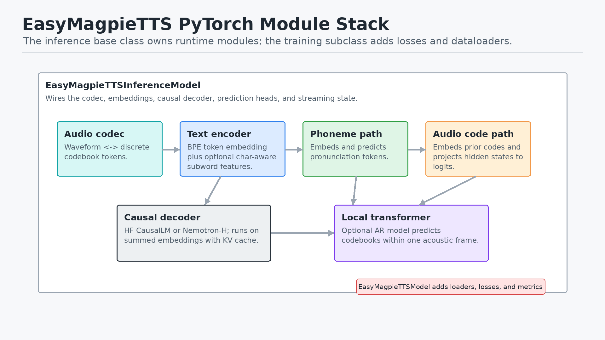
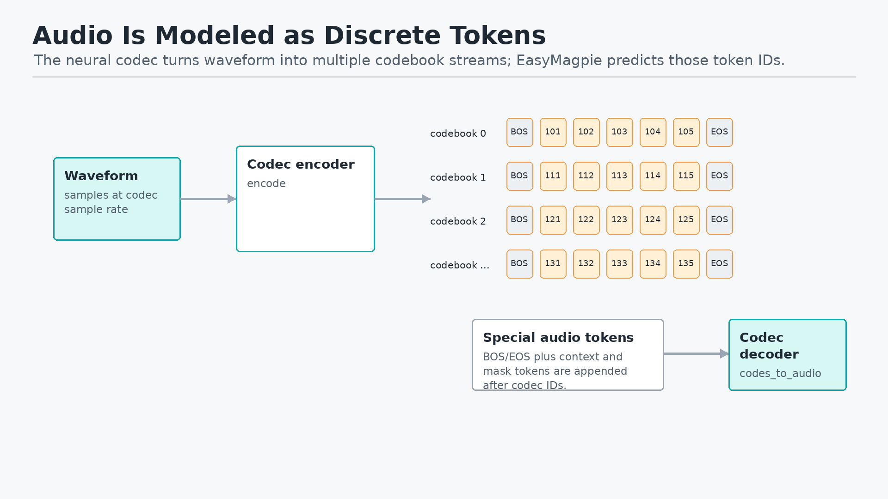
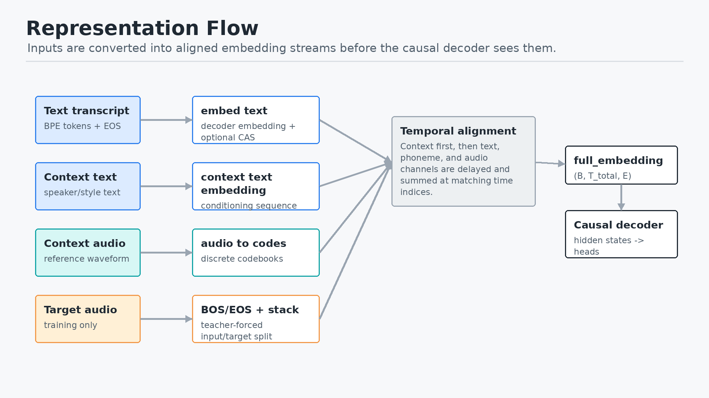
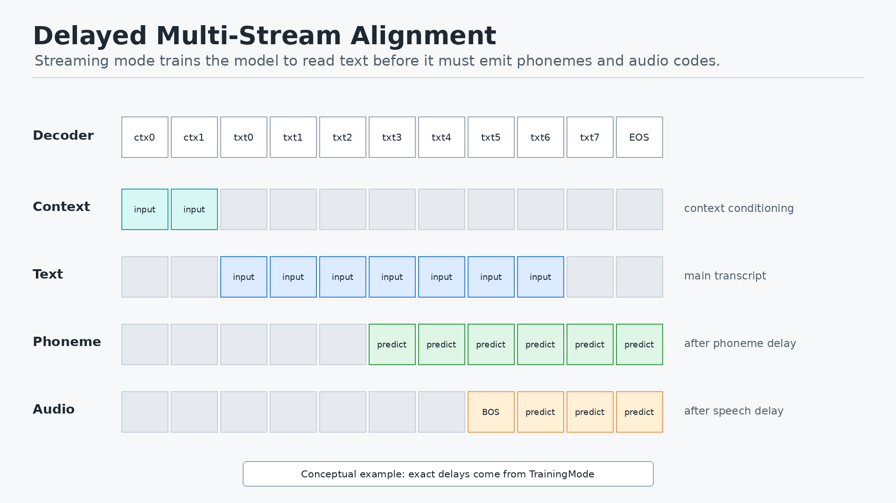
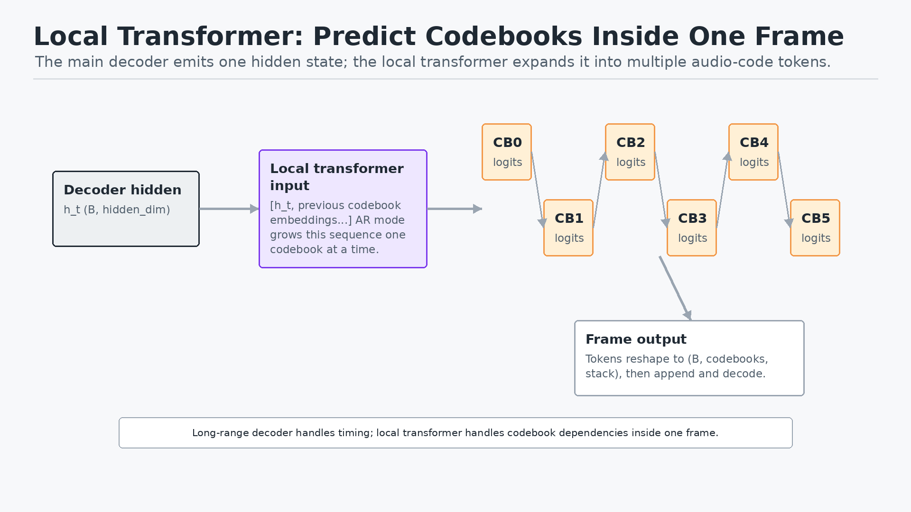
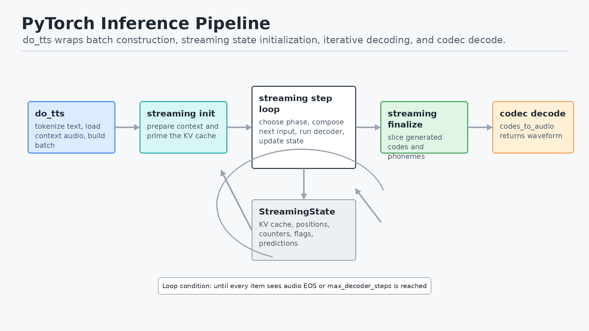
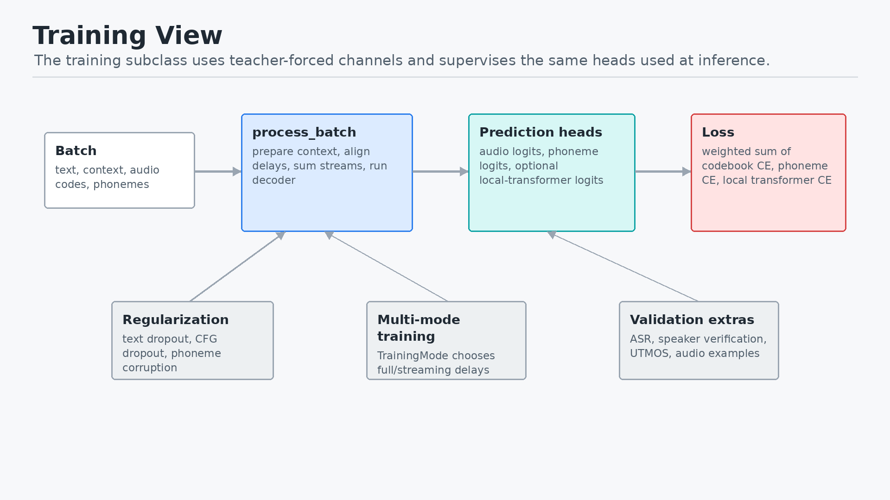

## Scope

- This deck explains the EasyMagpieTTS model as it runs in PyTorch.
- It intentionally does not focus on vLLM, Triton, TensorRT, or serving infrastructure.
- The useful code anchors are:
  - `nemo/collections/tts/models/easy_magpietts_inference.py`
  - `nemo/collections/tts/models/easy_magpietts.py`
  - `nemo/collections/tts/modules/magpietts_modules.py`

## One-Slide Mental Model

- EasyMagpieTTS is a decoder-only TTS model.
- It does not directly predict waveform samples.
- It predicts discrete audio codec tokens across multiple codebooks.
- A neural codec decoder turns those predicted codes back into waveform.
- Context audio and context text provide speaker/style conditioning.
- Text, phoneme, and audio streams are delayed and aligned so generation can run incrementally.

## Class Split

**`EasyMagpieTTSInferenceModel`**

- Owns the runtime architecture.
- Contains codec, embeddings, decoder backbone, prediction heads, streaming state, and `do_tts` / `infer_batch`.

**`EasyMagpieTTSModel`**

- Subclasses the inference model for training.
- Adds `process_batch`, dataloaders, losses, validation inference, and logging.

## Module Stack

{width=9.4in}

## Core Idea: Audio as Tokens

- The codec encoder maps waveform into codebook token sequences.
- EasyMagpie predicts those token IDs, including BOS/EOS-style special tokens.
- The codec decoder maps generated token sequences back to audio.
- This makes TTS look like language modeling over acoustic tokens.

## Audio Token Diagram

{width=9.4in}

## Inputs at Inference

- Main text transcript becomes text tokens plus EOS.
- Context text becomes a conditioning token sequence.
- Context audio becomes discrete codec codes.
- Optional ground-truth phoneme text can force the phoneme stream.
- The model builds a batch and delegates to the same streaming machinery used for batched inference.

## Representation Flow

{width=9.4in}

## Embedding Streams

- Text tokens use the decoder token embedding table.
- If configured, the char-aware subword encoder adds character-level subword information.
- Audio tokens use per-codebook embeddings that are averaged and projected.
- Phoneme tokens use their own embedding tables.
- The model sums aligned stream embeddings instead of concatenating separate modalities at each step.

## Delayed Stream Alignment

{width=9.4in}

## What the Delays Mean

- `TrainingMode` defines whether text is `full` or `streaming`.
- In streaming mode, text arrives first.
- Phoneme prediction starts after `streaming_phonemes_delay`.
- Audio prediction starts after `streaming_speech_delay`.
- The delay creates a lookahead buffer so audio generation has enough text/phoneme context.

## Decoder Backbone

- The backbone is selected by config:
  - Hugging Face causal LM backend.
  - Nemotron-H backend.
- The model calls the decoder with `inputs_embeds`, not just token IDs.
- Streaming inference uses KV cache through `past_key_values`.
- The backbone emits hidden states used by phoneme and audio-code heads.

## Prediction Heads

**Phoneme head**

- `phoneme_final_proj` maps decoder hidden states to phoneme-token logits.
- In predicted mode, low-confidence phoneme steps can be replaced with UNK.

**Audio-code head**

- `audio_out_projection` adapts decoder hidden size to audio embedding size.
- `final_proj` maps to logits for all codebooks and special audio tokens.

## Local Transformer

{width=9.4in}

## Why the Local Transformer Exists

- The main decoder models long-range text, phoneme, and acoustic timing.
- One audio frame contains several codebook tokens.
- Those codebooks are not independent.
- The local autoregressive transformer predicts codebooks within a frame sequentially.
- This lets the global decoder advance one frame at a time while still modeling codebook dependencies.

## PyTorch Inference Pipeline

{width=9.4in}

## Streaming State Machine

- Context phase: consume remaining context embeddings.
- Prompt phase: consume early text before any predictions are emitted.
- Phoneme-only phase: predict phonemes before audio starts.
- Audio phase: predict phonemes and audio codes until audio EOS or `max_decoder_steps`.
- Finalize: slice valid codes, unstack if needed, and decode with the codec.

## Training View

{width=9.4in}

## Losses

- Audio codebook CE supervises the main audio-code projection head.
- Phoneme CE supervises the phoneme prediction head when phoneme tokens exist.
- Local transformer CE supervises the per-frame codebook predictor when enabled.
- Total loss is a weighted sum controlled by config:
  - `parallel_codebook_loss_scale`
  - `phoneme_loss_weight`
  - `local_transformer_loss_scale`

## Training Regularization

- Text dropout makes the model less brittle to transcript conditioning.
- CFG conditioning dropout trains unconditional context behavior.
- Phoneme corruption makes audio generation robust to imperfect predicted phonemes.
- Multi-mode training lets the same model learn different text/delay regimes.

## Shape Cheat Sheet

- Text tokens: `(B, T_text)`
- Context audio codes: `(B, C, T_context)`
- Embedded sequence: `(B, T_total, E)`
- Decoder hidden states: `(B, T_total, hidden_dim)`
- Audio logits: `(B, T_audio, C * vocab_per_codebook)`
- Generated audio codes: `(B, C, T_audio_frames)`
- Decoded waveform: `(B, num_samples)`

## Presenter Narrative

- Start with the codec: "The model speaks by predicting codec tokens, not waveform."
- Then explain conditioning: "Reference audio and context text anchor voice and style."
- Then explain alignment: "Text, phoneme, and audio are delayed streams summed into one decoder input."
- Then explain inference: "A streaming state object feeds one embedding step at a time through a causal decoder."
- Then explain quality/control: "The phoneme path and local transformer make token generation more structured."
- Close with training: "The same heads are teacher-forced and supervised with cross-entropy."

## Takeaways

- EasyMagpieTTS is best understood as codec-token language modeling for speech.
- The PyTorch model is a multimodal embedding composer plus a causal decoder.
- Streaming works because the model maintains explicit phase counters and KV cache.
- The local transformer handles short-range dependencies among codebooks inside each frame.
- The codec decoder is the final waveform renderer.
