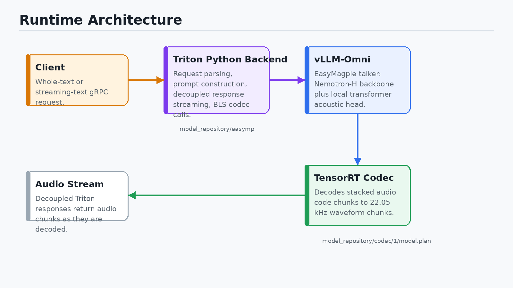
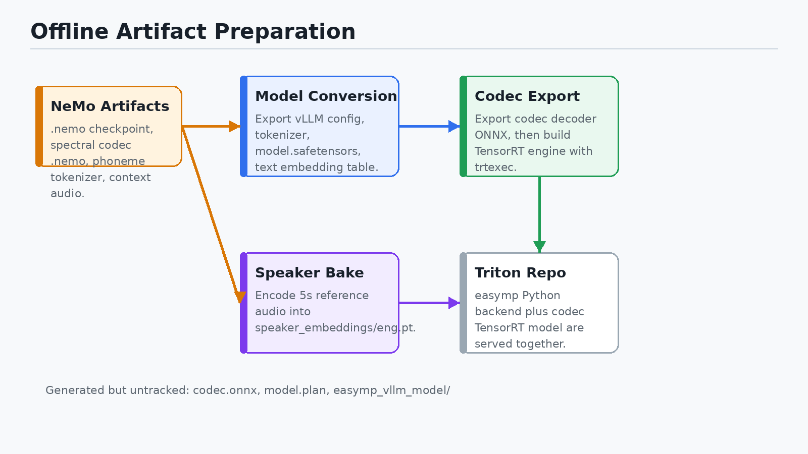
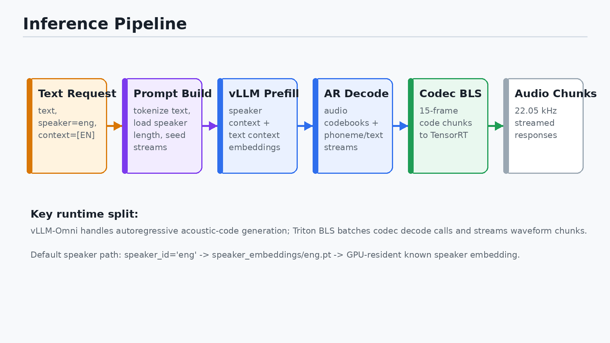
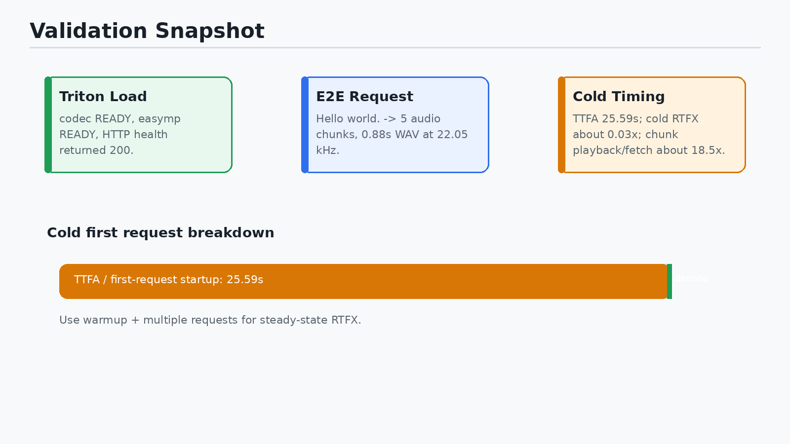

## What We Built

- Ported EasyMagpieTTS from NeMo artifacts into a vLLM-Omni runtime.
- Served the autoregressive TTS model and codec decoder through Triton.
- Built the missing TensorRT codec engine.
- Baked a default English speaker embedding.
- Validated an end-to-end gRPC request returning 22.05 kHz audio.

## Starting Inputs and Final Outputs

**Inputs**

- EasyMagpieTTS `.nemo` checkpoint
- Spectral codec `.nemo`
- Phoneme tokenizer
- English context audio sample

**Outputs**

- `easymp_vllm_model/`
- `codec.onnx`
- `model_repository/codec/1/model.plan`
- `speaker_embeddings/eng.pt`
- Triton model repository serving `easymp` + `codec`

## Runtime Architecture

{width=9.2in}

## Runtime Architecture: Key Ideas

- Triton owns the service boundary and response streaming.
- The Python backend is the orchestration layer.
- vLLM-Omni runs the EasyMagpie autoregressive acoustic-code generator.
- TensorRT runs codec decoding as a separate Triton model.
- Triton BLS calls connect generated code chunks to codec decode calls.

## Offline Artifact Preparation

{width=9.2in}

## Artifact Preparation: What Changed

- Conversion scripts were patched to run from the local checkout.
- Heavy NeMo imports were made lazy so `--help` and test collection stay light.
- CPU restore was made viable through `map_location`.
- The `.nemo` checkpoint was converted into a Hugging Face/vLLM-style model directory.
- The codec decoder was exported to ONNX, then compiled to TensorRT.

## EasyMagpie Model Inside vLLM-Omni

**Backbone**

- Nemotron-H decoder
- Mamba/attention hybrid layers
- Runs through vLLM's compiled model executor

**TTS-specific heads**

- Local autoregressive transformer
- Multi-codebook acoustic token generation
- Phoneme/text/audio stream delay semantics

**Conditioning**

- Text tokenizer and baked text embedding lookup
- Known speaker embedding loaded from `speaker_embeddings/eng.pt`
- Context text defaults to `[EN]`

## Inference Pipeline

{width=9.2in}

## Whole-Text Request Flow

1. Client sends text to Triton gRPC.
2. Python backend selects speaker id `eng` and context text `[EN]`.
3. Backend builds prompt length and sampling metadata.
4. vLLM-Omni generates stacked audio-code tokens.
5. Backend chunks codes into 15-frame codec windows.
6. TensorRT codec model decodes codes into waveform chunks.
7. Triton decoupled responses stream audio back to the client.

## Speaker Embedding Path

**Problem**

- The Triton config defaulted to `speaker=eng`.
- The converted model had no `speaker_embeddings/eng.pt`.
- First request reached the model, then failed at speaker resolution.

**Fix**

- Used `context_audios/audio_context_samples/english_audio_context_samples/Emma_Additional.flac`.
- Loaded the NeMo EasyMagpie model in a disposable NeMo/Riva container.
- Called the existing `extract_speaker_embedding()` helper directly.
- Saved `speaker_embeddings/eng.pt` with shape `(64, 1536)`.

## Codec Path

**ONNX stage**

- Codec decoder exported as `codec.onnx`.
- Graph input: stacked model codes.
- Clamp, unstack, index conversion, and decode are baked into the graph.

**TensorRT stage**

- Built `model.plan` from `codec.onnx`.
- Static frame profile: 15 model frames.
- Batch profile: 1 / 8 / 32.
- FP32 engine was used for the working serving path.

## Triton Model Repository

```text
model_repository/
  easymp/
    config.pbtxt
    1/model.py
  codec/
    config.pbtxt
    1/model.plan
```

**`easymp`**

- Python backend.
- Starts vLLM-Omni.
- Streams responses in decoupled mode.

**`codec`**

- TensorRT plan backend.
- Dynamically batches codec decode calls.

## Validation Snapshot

{width=9.2in}

## Validation Details

- Triton health endpoint returned HTTP `200`.
- `codec` reached `READY`.
- `easymp` reached `READY`.
- End-to-end request:

```text
utt1    Hello world.
```

- Result: `1 ok / 0 failed`.
- Output: `/tmp/easymp_e2e_out/utt1.wav`.
- WAV: mono, 22.05 kHz, 16-bit PCM, 0.88 seconds.

## Performance Interpretation

**Cold first request**

- Audio duration: 0.88 seconds.
- Wall time: 25.65 seconds.
- TTFA: 25.59 seconds.
- Cold RTFX: about 0.03x.

**Why cold RTFX is misleading**

- First request includes vLLM/Triton JIT behavior and startup path costs.
- Chunk fetch/playback factor after first audio was about 18.5x realtime.
- Use warmup plus multiple requests for steady-state RTFX.

## Operational Guardrails

- Keep vLLM/vLLM-Omni isolated from the active NeMo development environment.
- Do not kill unknown GPU processes.
- Treat generated artifacts as large, untracked outputs unless explicitly approved.
- Rebuild TensorRT plans when changing TensorRT/CUDA/runtime version.
- Re-bake speaker embeddings when changing the default voice or reference audio.

## Final Status

**Completed**

- Docker runtime image built.
- TensorRT codec plan built.
- English speaker embedding baked.
- Triton service validated.
- End-to-end request returned audio.

**Remaining useful work**

- Run warm steady-state benchmarks.
- Add a clean embedding-only helper script.
- Decide whether generated artifacts should be stored, uploaded, or ignored.
- Test streaming-text mode separately from whole-text mode.
